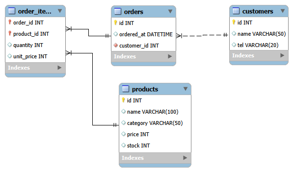

# 2주차 산출물 — 쇼핑몰 ERD 설계 + 크롤링 파이프라인

MySQL 8.0 · 분석 쿼리 · MongoDB · ERD · 크롤러를 다룬 2주차 결과물입니다.
이 폴더에는 **ERD 설계서**와 **크롤러 소스** 두 가지가 들어 있습니다.

## 폴더 구성

| 파일 | 설명 |
|---|---|
| `ERD_설계서.md` | 엔터티 정의 · 관계 · 정규화 근거 · 반정규화 결정 · DDL |
| `ERD.png` / `ERD.mwb` | ERD 이미지 / MySQL Workbench 원본 모델 |
| `check_robots.py` | 수집 전 robots.txt로 수집 가능 여부 확인 |
| `crawler_pipeline.py` | 수집(fetch) → 정제(parse) → 적재(load) 크롤러 |


## 1. ERD 설계서

- 파일: [ERD_설계서.md](ERD_설계서.md)
- 표 4개: `customers` · `products` · `orders` · `order_items`
- 주문과 상품의 N:M 관계를 `order_items` 교차 표로 해소했습니다.
- 정규화(1~3NF) 근거와, `order_items.unit_price`(주문 당시 가격 스냅샷)를 두는 반정규화 결정을 정리했습니다.



## 2. 크롤러

- 대상: https://quotes.toscrape.com (크롤링 연습용 공개 사이트, 수집 허용 확인 완료)
- 구조: `fetch`(수집) → `parse`(정제) → `load`(적재) **3함수 분리**
- 크롤링 예절
  - `User-Agent`에 수집 목적을 표기했습니다.
  - 요청 간격은 1초입니다. (`time.sleep`)
  - 수집 전에 `robots.txt`를 확인합니다. (`check_robots.py`)
- 중복 방지: `quotes` 표의 `UNIQUE(author, quote_text)` 제약과 `INSERT IGNORE`를 사용합니다.
  파이썬 코드에는 중복 검사 로직이 없고, DB 제약이 중복을 막습니다.
- 안전장치
  - 요청이 실패하면 최대 3회 재시도하며, 대기 시간은 2초 → 4초 → 6초로 늘어납니다. (백오프)
  - `429 Too Many Requests`는 5초 대기 후 재시도합니다.
  - 끝내 실패한 URL은 `failed.log`에 시각 · URL · 원인을 기록합니다.
- DB 접속은 `run()`에서 한 번만 열고, 페이지마다 `commit()`합니다.
  중간에 오류가 나도 앞 페이지의 적재분은 남고, `finally`에서 연결을 닫습니다.

## 3. 실행 방법

사전 준비: Docker, Python 3.9 이상

```bash
# 1) MySQL 컨테이너 준비 (처음 한 번만 run, 이후에는 start)
docker run -d --name de-mysql \
  -e MYSQL_ROOT_PASSWORD=dataeng123 -e MYSQL_DATABASE=shop \
  -p 3306:3306 -v de-mysql-data:/var/lib/mysql mysql:8.0
# 이미 만들어 둔 경우: docker start de-mysql

# 2) 가상환경 + 패키지
python3 -m venv .venv && source .venv/bin/activate
pip install requests beautifulsoup4 pymysql
```

적재할 표를 만듭니다. (`docker exec -it -e LANG=C.UTF-8 de-mysql mysql -uroot -pdataeng123 shop` 으로 접속한 뒤 실행)

```sql
CREATE TABLE quotes (
  id INT AUTO_INCREMENT PRIMARY KEY,
  author VARCHAR(100) NOT NULL,
  quote_text TEXT NOT NULL,
  tags VARCHAR(300),
  crawled_at DATETIME NOT NULL,
  UNIQUE KEY uq_author_text (author, quote_text(200))
);
```

크롤러를 실행합니다.

```bash
python3 check_robots.py        # 수집 가능 여부 확인
python3 crawler_pipeline.py    # 10페이지 수집·적재
```

> `DB_CONFIG`의 접속 정보는 수업용 로컬 컨테이너 값이며, 실제 서비스 계정이 아닙니다.

## 4. 검증한 것

| 확인 항목 | 결과 |
|---|---|
| robots.txt | `can_fetch` = True, `crawl_delay` = None (robots.txt가 404라서 금지 규칙이 없는 것으로 해석됨) |
| 중복 방지 | 이미 수집된 1~3페이지를 다시 실행하면 `parsed 10 / saved 0` (UNIQUE 제약이 거부) |
| 전체 수집 | 4~10페이지 `parsed 10 / saved 10`, `SELECT COUNT(*) FROM quotes` 결과 **100** |
| 재시도 | 없는 주소로 시험하면 404 오류가 3회 재시도된 뒤 `failed.log`에 기록됨 |

## 5. 남은 개선점

- `tags`를 쉼표 문자열로 저장하고 있습니다. (1NF 위반) → `quote_tags` 교차 표로 분리할 예정입니다.
- DB 접속 정보(비밀번호 포함)가 코드의 `DB_CONFIG`에 직접 적혀 있습니다. → 환경변수(`.env`)로 분리할 예정입니다.
- 특정 페이지 수집에 실패하면 그 지점에서 수집이 멈춥니다. → 페이지 번호로 주소를 만들어, 실패한 페이지만 건너뛰고 계속 진행하도록 개선할 예정입니다.
- 같은 데이터를 MongoDB에도 적재해 MySQL 코드와 비교해 볼 계획입니다.
